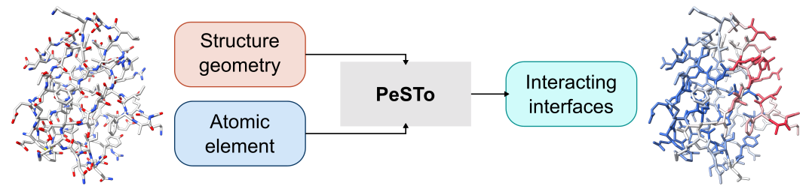

# PeSTo: parameter-free geometric deep learning for accurate prediction of protein interfaces with small- and macro-molecules

PeSTo (Protein Structure Transformer) is a parameter-free geometric deep learning method to predict protein interaction interfaces from a protein structure. It is available for free without registration as an online tool ([pesto.epfl.ch](https://pesto.epfl.ch/)).

## Installation
Download the source code and examples by cloning the repository.
```
git clone https://github.com/LBM-EPFL/PeSTo.git
cd PeSTo
```

The primary requirements for PeSTo are [GEMMI](https://gemmi.readthedocs.io/en/latest/) to parse PDB files and [PyTorch](https://pytorch.org/) for the deep learning framework. During training, [h5py](https://www.h5py.org/) is used to store the processed data in an optimized format. The predicted interfaces can be visualized using [PyMOL](https://pymol.org/2/) or [ChimeraX](https://www.cgl.ucsf.edu/chimerax/). All the specific dependencies are listed in [pesto.yml](pesto.yml). The specific dependencies can be easily installed using [Anaconda](https://www.anaconda.com/). Create and activate the environement with:

```
conda env create -f pesto.yml
conda activate pesto
```

Almost all examples and code to reproduce the results are available as 
[Jupyter](https://jupyter.org/) notebooks. Start a JupyterLab session with:
```
jupyter-lab
```

## Application

A set a Jupyter notebooks and python scripts are available to apply our trained model.

### Interfaces predictions

The PeSTo model can be applied to PDB files using the [apply_model.ipynb](apply_model.ipynb) notebook. Specify the path to the folder containing the PDB files using the `data_path` variable. We recommand using the latest model (`i_v4_1`) but other pre-trained variants are available. The predictions can be run on CPU or GPU.

The predictions for the interfaces are stored in the b-factor field of the PDB files using a value from 0 (no interface) to 1 (interface). The predicted interfaces can be visualized with a color gradient per residue. This can be done in [PyMOL](https://pymol.org/2/) with,
```
spectrum b, blue_white_red, all, 0, 1
```

Or in [ChimeraX](https://www.cgl.ucsf.edu/chimerax/) with
```
color bfactor palette "#2B59C3:#D1D1D1:#D7263D" range 0,1
```

## Reproducibility

We provide all the Jupyter notebooks and scripts used to obtain and process the data, train and evaluate the model. The latest model (`i_v4_1`) is used for the benchmarks and results shown in the paper.

### Interfaces prediction

All bioassemblies used are [downloaded](data/rsyncPDB.sh) from [RCSB PDB](https://www.rcsb.org/). The subunits are split into training, testing and validation dataset according to 30% sequence similarity clusters ([processing/split_dataset.ipynb](processing/split_dataset.ipynb)). Finaly, we preprocess the structure, detect the interfaces within complexes and store the features and labels into an optimized HDF5 format ([processing/build_dataset.py](processing/build_dataset.py)). 

The `model` folder contains the scripts to train the model as well as the selected pre-trained models in `model/save`. The benchmark and comparison can be reproduced with the `interface_*.ipynb` notebooks.

### MD analysis

Scripts and functions to perform predictions and analysis on MD are found in the `md_analysis` folder. Molecular dynamics are loaded using [MDTraj](https://www.mdtraj.org/). An utility tool called `data_manager` was developed to easily locate simulations within a defined tree-folder structure. We also developed analysis tools based on MDTraj (`mdtraj_utils`).

### Interfacome

The `interfaceome` folder contains the Jupyter notebooks and python scripts used to download, process and analyse the data. All the AlphaFold-predicted structures used can be downloaded freely from the [AlphaFold Protein Structure Database](https://alphafold.ebi.ac.uk/). Only the corresponding [UniProt](https://www.uniprot.org/) data is downloaded ([interfaceome/download_uniprot.py](interfaceome/download_uniprot.py)). We also download the PAE from the AlphaFold Protein Structure Database ([interfaceome/download_af_pae.py](interfaceome/download_af_pae.py)).

### Other available pre-trained models

We provide 4 variants of the trained PeSTo models:
1. `i_v3_0` is composed of 16 geometric transformers and uses both atom element and residue type information
2. `i_v3_1` is composed of 16 geometric transformers and uses both atom element and residue type information but only predicts protein-protein interfaces
3. `i_v4_0` is composed of 16 geometric transformers and uses only atom element
4. `i_v4_1` is composed of 32 geometric transformers and uses only atom element

## Web server

It is possible to use PeSTo without requiring the user to install it using our web server freely available at [pesto.epfl.ch](https://pesto.epfl.ch/). PDB ID, UniProt ID or PDB files are accepted. The predictions are fast and can be visualized directely in the browser or downloaded as PDB files.

## License

This work is licensed under a
[Creative Commons Attribution-NonCommercial-ShareAlike 4.0 International License][cc-by-nc-sa].

[![CC BY-NC-SA 4.0][cc-by-nc-sa-image]][cc-by-nc-sa]

[cc-by-nc-sa]: http://creativecommons.org/licenses/by-nc-sa/4.0/
[cc-by-nc-sa-image]: https://licensebuttons.net/l/by-nc-sa/4.0/88x31.png
[cc-by-nc-sa-shield]: https://img.shields.io/badge/License-CC%20BY--NC--SA%204.0-lightgrey.svg

## Reference
